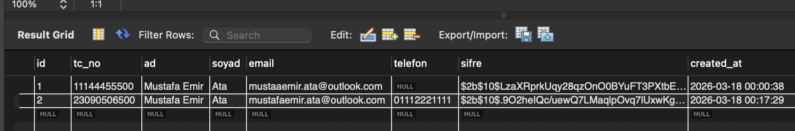
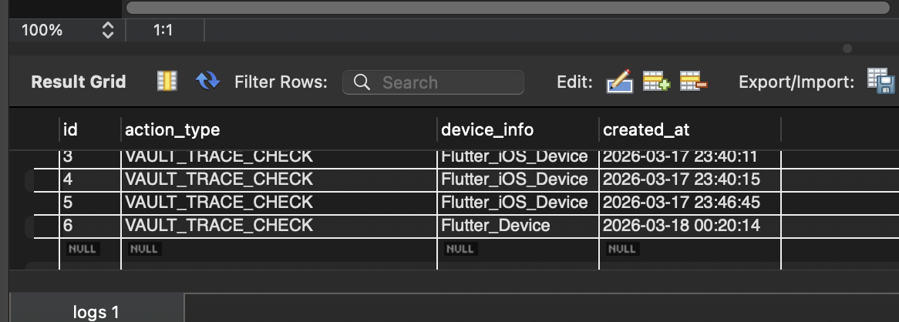
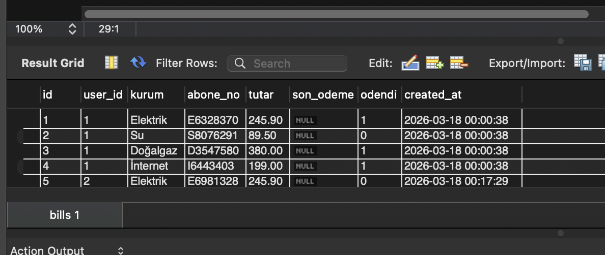
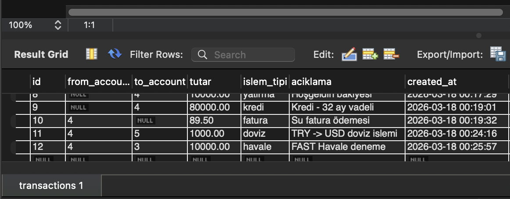
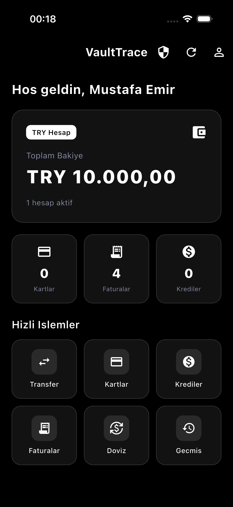
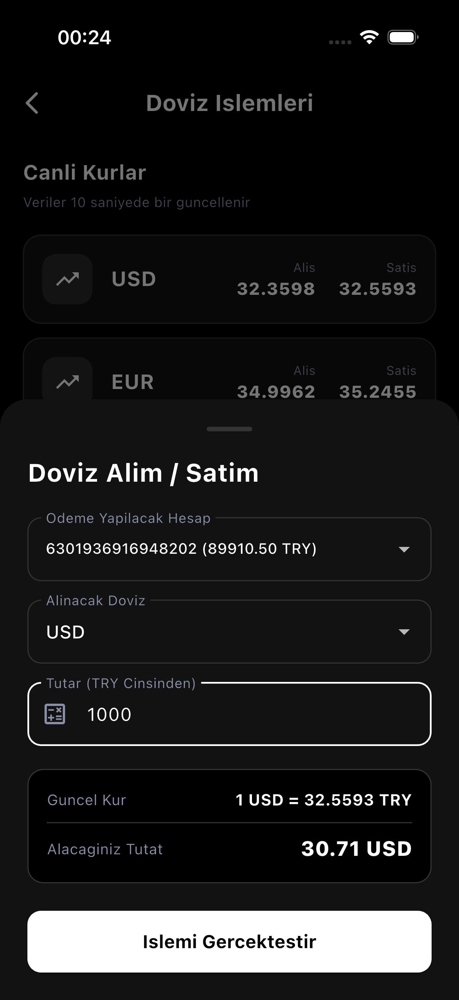
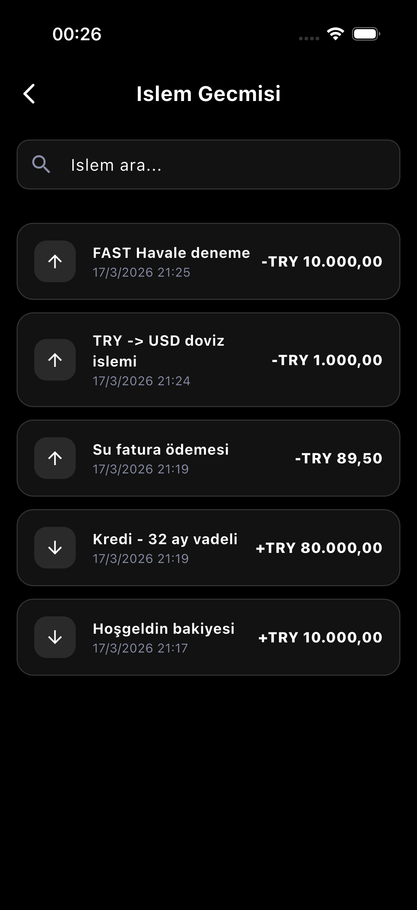
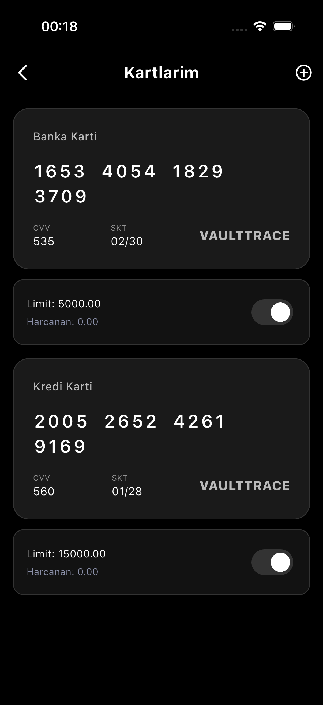
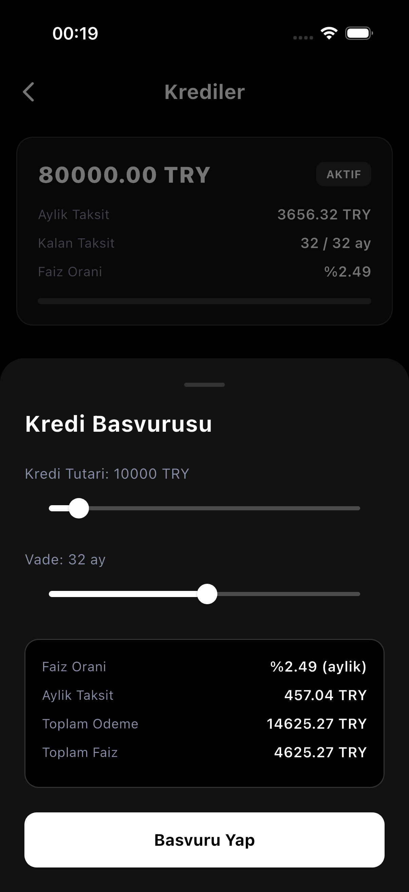
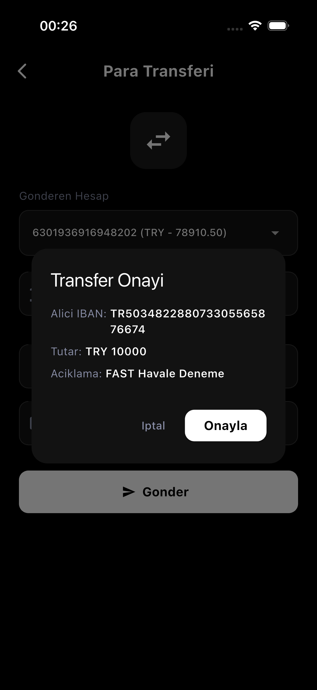

# 🛡️ VaultTrace: Güvenli Bankacılık API Katmanı ve Sistem Denetim Projesi

**VaultTrace**, modern bankacılık standartlarında bir backend mimarisi ile Flutter mobil arayüzünü birleştiren, uçtan uca veri güvenliği ve sistem denetimi odaklı bir projedir.

## 🚀 Kullanılan Teknolojiler

### **Mobil (Frontend)**
* **Flutter & Dart:** Cross-platform mobil uygulama geliştirme.
* **HTTP Package:** REST API haberleşmesi ve asenkron veri yönetimi.
* **Material Design 3:** Modern ve kullanıcı dostu finansal arayüz tasarımı.

### **Sunucu (Backend)**
* **Node.js & Express.js:** Ölçeklenebilir API mimarisi.
* **MySQL:** İlişkisel veritabanı yönetimi (RDBMS).
* **JWT (JSON Web Token):** Güvenli oturum ve yetkilendirme yönetimi.
* **Bcrypt:** Şifrelerin tek yönlü hashlenerek güvenli saklanması.
* **Dotenv:** Çevresel değişkenlerin (Credentials) güvenli yönetimi.

---

## 🔒 Güvenlik ve Veri Koruma Katmanı

Proje, bankacılık veri gizliliği standartlarını (PCI-DSS prensipleriyle paralel) korumak amacıyla aşağıdaki güvenlik protokollerini uygular:

1.  **Bcrypt ile Şifre Hashleme:** Kullanıcı şifreleri veritabanına asla düz metin olarak kaydedilmez. `Bcrypt` algoritması kullanılarak "Salt" eklenmiş ve tek yönlü hashlenmiş şekilde saklanır. Bu sayede veritabanı ele geçirilse bile şifreler geri döndürülemez.
2.  **JWT (JSON Web Token) Kimlik Doğrulama:** Oturum yönetimi stateless bir yapıda, JWT ile sağlanır. Her hassas API isteği (para transferi, hesap detayları), sunucu tarafında doğrulanmış bir Bearer Token gerektirir.
3.  **Hassas Veri İzolasyonu (.env):** Veritabanı şifreleri, JWT secret keyleri ve port bilgileri gibi kritik değişkenler `.env` dosyasında izole edilerek kod tabanından ayrılmıştır.
4.  **Audit Logging (Denetim İzleri):** Tüm kritik sistem hareketleri, sunucu tarafında otomatik yönetilen bir `logs` tablosuna anlık olarak kaydedilerek tam traceability (izlenebilirlik) sağlanmıştır.

---

## 🖥️ Veritabanı ve Sistem Görüntüleri (MySQL)

| **Hesap Yönetimi** | **Güvenlik Logları (Audit)** |
|:---:|:---:|
|  |  |
| **Ödemeler Paneli** | **İşlem Kayıtları (SQL)** |
|  |  |

---

## 📱 Uygulama Arayüzü Görüntüleri (Flutter)

| **Ana Sayfa** | **Döviz İşlemleri** |
|:---:|:---:|
|  |  |
| **İşlem Geçmişi** | **Kartlarım** |
|  |  |
| **Kredi Başvurusu** | **Para Transferi** |
|  |  |

---

## ⚙️ Kurulum

1.  **Backend:** `npm install` komutuyla paketleri kurun ve `.env` dosyanızı yapılandırıp `node server.js` ile başlatın.
2.  **Frontend:** `flutter pub get` sonrası emülatör veya gerçek cihazda çalıştırın.

---

### **Geliştirici**
**Mustafa Emir Ata**
